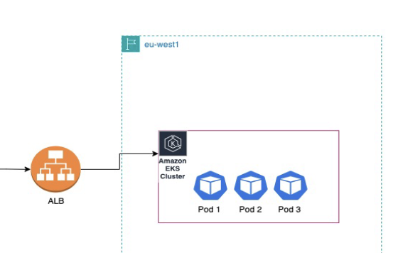

# Terraform EKS Deployment

This project sets up an EKS cluster with associated resources using Terraform.



## Prerequisites
- Terraform installed
- AWS CLI configured with appropriate permissions
- kubectl installed and configured
- Helm installed (for managing Kubernetes charts)

## Files Overview


- **0-locals.tf**: Defines local variables for environment settings such as region, availability zones, and EKS cluster name.
- **1-providers.tf**: Configures the Terraform providers, including AWS, and sets up the required version constraints.
- **2-vpc.tf**: Creates the main VPC resource, defining its CIDR block and enabling DNS support.
- **3-igw.tf**: Provisions the Internet Gateway (IGW) for public internet access.
- **4-subnets.tf**: Defines public and private subnets for the VPC across different availability zones.
- **5-nat.tf**: Configures the NAT Gateway for routing outbound traffic from private subnets.
- **6-routes.tf**: Sets up route tables and associations for public and private subnets.
- **7-eks.tf**: Defines the EKS cluster resource, including its IAM role and associated policies.
- **8-nodes.tf**: Configures EKS worker nodes, including their IAM roles and scaling options.
- **9-pod-identity.tf**: Adds Kubernetes pod identity support for workload-specific IAM roles.
- **10-aws-lbc.tf**: Sets up the AWS Load Balancer Controller for Kubernetes ingress and load balancing.
- **11-helm-provider.tf**: Configures the Helm provider to manage Kubernetes charts within the cluster.
- **12-iam-oidc.tf**: Configures IAM OIDC settings for EKS to allow secure access to AWS resources from within the cluster.

### locals.tf

This file defines key environment-specific variables that can be easily customized for deploying the infrastructure. Below are the variables included:

- **`env`**: Specifies the environment (e.g., `demo`).
- **`region`**: AWS region for the infrastructure (e.g., `us-west-2`).
- **`zone1`** and **`zone2`**: Availability zones (e.g., `us-west-2a` and `us-west-2b`).
- **`eks_name`**: Name of the EKS cluster (e.g., `pizza`).
- **`eks_version`**: Kubernetes version for the EKS cluster (e.g., `1.31`).
- **`bucket`**: S3 bucket name for storing the Terraform state file (e.g., `aleksey-tf-state`).


## Deployment Flow

1. Set up the AWS CLI with appropriate credentials:
   ```bash
   aws configure
   ```

2. Initialize Terraform:
   ```bash
   terraform init
   ```

3. Deploy the infrastructure:
   ```bash
   terraform plan
   terraform apply
   ```
4. Configure kubectl to access the EKS cluster:
    ```bash 
    aws eks --region <region> update-kubeconfig --name <eks_name>

5. Access the application via the ALB DNS:
    Obtain the DNS name of the ALB from the ingress:

```bash
kubectl describe ingress myapp
```
6. Open the DNS in your browser.


## Post-Deployment Steps

Once the EKS cluster is up, deploy the application using the provided Kubernetes manifests:

Apply the Kubernetes manifests:

```bash
kubectl apply -f deployments/
```

This will provision an Application Load Balancer (ALB) for your application and expose it to the internet.


## Clean-Up Instructions

To clean up the infrastructure, run the following command:

```bash
terraform destroy
```

This will remove all the resources created by Terraform.

## Cheers! 🍻

Congratulations! You've successfully spun up an EKS cluster with an Application Load Balancer (ALB). You truly deserve a cold beer for your hard work! 🍺